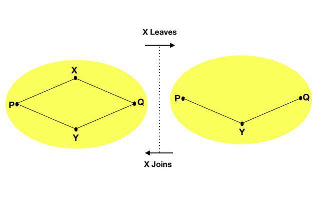
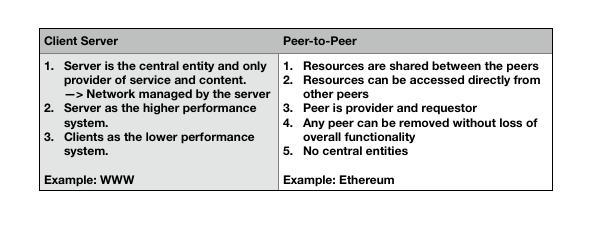
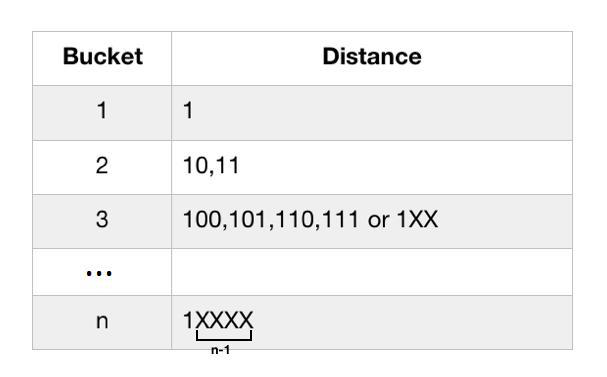
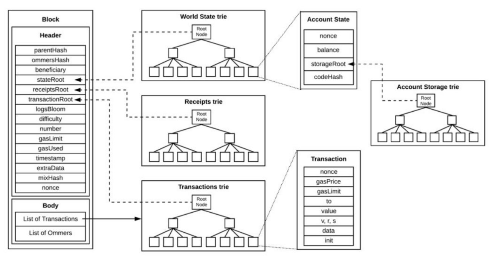
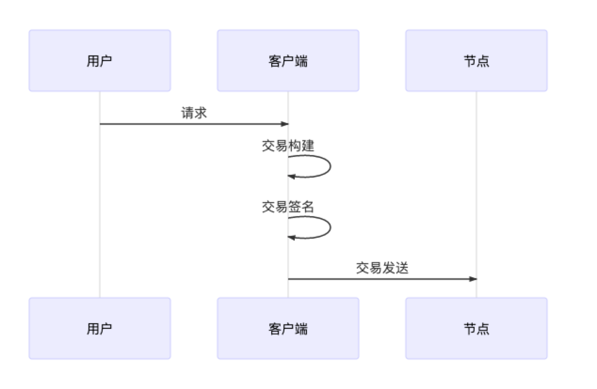
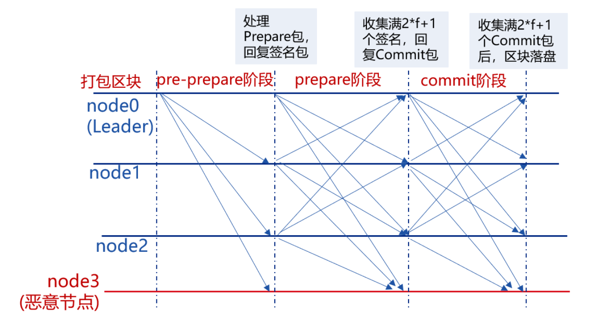

## 第2章 Simplechain联盟链功能模块介绍
### 2.1 区块结构介绍
区块结构分为两部分，即区块头和区块体。区块头就是simplechain中的区块链部分。它保存了前一个区块（也可称为父区块）的哈希值，通过区块头的连接形成了一条由密码学背书的链。区块体包含了此区块中记录的一系列交易，以及叔块（ommer）区块头列表。

#### 2.1.1 区块头

- stateRoot：世界状态树的根节点哈希值（在所有交易被执行后）。
- transactionsRoot：交易树根节点的哈希值。这棵树包含了区块体的所有交易。
- receiptsRoot：每当交易执行时，simplechain都会生成对应结果的交易收据。此处就是这个交易收据树的根节点哈希。
其中交易树、收据树和状态树均是是Merkle Patricia Tree.

三棵树求取根哈希，可以得到区块头中的StateRoot,TransactionsRoot,ReceiptsRoot三个字段。这样就建立了交易和区块头字段的映射。当其他用户收到块，根据块里的交易可以计算出收据和状态，计算三个根哈希后和区块头的三个字段进行验证，判断这是否为合法的块。

#### 2.1.2 区块体

区块体内以MPT的形式，存储着区块内的全部交易信息，并最终产生transactionsRoot。每个区块能容纳多少笔交易与每笔交易的gasuse以及整个区块的gaslimt有关。

### 2.2 网络模块
#### 2.2.1节点发现
点对点（P2P）网络是一种网络覆盖层（overlaynetwork）——就是说，它是建立在公开互联网之上的。从数学的角度来说，P2P网络可以被视作一个有向图G=(V,E)，其中V是网络中的对等节点集合，E是对等节点所连成的边的集合（也即节点间连接的集合）。每个对等节点p都有一个独一无二的标识号pid。集合E中的边（p，q）指p可通过直接相连的路径向q发送消息；也就是说，p使用q的pid作为目的地址，在网络之上向q发送消息。尽管在底层的TCP/IP网络中，相似的IP地址可以转译为在地理位置上相互接近，但很少有这么明确的直接关联。

理想情况下，所有的对等节点间都应该有一条路径相连。但因为每个节点对网络拓扑和其他对等节点只有一个不完整的视图，所以网络覆盖层需要中间节点将消息转发至正确目的。图的结构为每对节点提供了多条中间路径，因此就算对等节点改变，也可通过图的连通性提供网络的恢复能力。对每个对等节点来说，图的连通性通过与其他对等节点的邻接关系来反映。当对等节点加入或者离开网络，邻接的对等节点可能会持有不正确的邻接信息。因此使用网络覆盖层维护机制（Overlaymaintenancemechanisms）保存更新的邻接信息，使得所有节点间保持连通性。

P2P网络中的参与者向其他网络参与者提供部分资源。不需要中心化的协调者，每个对等节点都可贡献计算周期（CPU），磁盘存储和网络带宽。传统的节点-服务器模型中，服务器提供资源，节点使用资源；与之相对的，在P2P网络中，对等节点既是网络资源的供应者，也是消费者。因此，P2P网络可以很好地解决节点-服务器模型下的一些短板，比如可扩展性和单点故障。

一般来说，P2P网络会有一个门槛，节点的资源贡献高于这个门槛才能加入网络。度量资源贡献的标准应该是公平的，比如说，要求网络中每个对等节点的平均贡献应该在P2P系统总体平均值的统计范围内等。资源贡献应该是双方互惠的。付出贡献后可得到的利益，吸引着用户加入P2P应用。

simplechain联盟链是基于一种覆盖层维护机制（称作Kademlia分布式哈希表）实现了对等节点发现协议（RLPx节点发现协议）。虽然Kademlia是为了在P2P网络中有效地定位和存储内容而设计的，simplechain联盟链的P2P网络只用它来发现新的对等节点。

Kademlia：simplechain联盟链中，每个节点都配备有一个enodeID，之后将此ID用SHA3算法散列为一个256位的值。Kademlia使用XOR操作定义距离，因此两个256位的数字之间的距离是他们的按位异或值（bitwiseexclusiveOR）。每个对等节点都拥有一个包含256个不同的桶（buckets）的数据结构，每个桶i中存储与本节点距离在2i-1到2i之间的16个节点。为了发现一个新的对等节点，simplechain节点选择自己作为目标x，从桶中寻找到16个与目标x最近的节点，之后请求这16个节点，让它们从自己的桶中各找出16个与目标x“更近”的节点并返回，这样以来，会得到至多16x16个新发现的节点。之后请求这16x16个新发现的节点中离目标x最近的16个节点，让它们返回与x更近的16个节点。这个过程持续迭代，直到没有新节点被发现。

对等节点间通信：simplechain联盟链使用UDP连接交换P2P网络的信息。有4种类型的UDP消息。一条ping消息请求一条pong消息作为返回。此对消息用来判断相邻节点是否可响应。一条findnode消息请求一条neighbors消息（其中包含16个已经被响应节点知晓的节点列表）作为返回。当建立好对等节点的连接之后，节点通过加密和认证的TCP连接来交换区块链信息。

数据结构：节点用两种数据结构存储其他节点的信息。第一种是称作db的长期数据库，它存储在磁盘内，节点重启之后数据也是持久存在的。db中包含节点交互过的每个节点信息。db的每条记录包含节点ID，IP地址，TCP端口，UDP端口，（此节点）最后一次向（记录中）节点发送ping的时间，最后一次从节点收到pong的时间，节点响应findnode消息的失败次数。如果最后一次从一个节点收到pong消息的时间超过了一天，此节点将会被移出db。第二种数据结构是称作table的短期数据库。当节点重启时table是空的。table包含256个桶，每个桶存储至多16条记录。每条记录存储其他simplechain节点的信息——节点的ID，IP地址，TCP端口和UDP端口。如果记录中的某个节点对于findnode消息连续响应失败，多于4次时将被移出table。

当某个节点第一次启动时，它的db是空的，只知道6个硬编码的引导节点。随后，当节点开始发现对等节点，节点依据上面描述的机制，将节点加入db和table。

RLPx协议：simplechain联盟链网络节点间的通信采用P2P线上协议。节点间采用RLPx编码及认证的通信传输协议来传输消息包，即提供发送和接收消息的协议功能。P2P节点采用RLPx的发现协议DHT来实现邻节点的发现。

#### 2.2.2 节点加入网络

先大致讲下同步流程，以新加入网络的节点A和节点B为例：
- 1.两个节点先hadeshake同步下各自的genesis、td、head等信息。
- 2.连接成功后，节点B发送TxMsg消息把自己的txpool中的tx同步给节点A
- 3.然后各自循环监听对方的消息；
- 4.节点A此时使用fast sync同步数据，依次发送GetBlockHeadersMsg、GetBlockBodiesMsg、GetReceiptsMsg、GetNodeDataMsg获取block header、block body、receipt和state数据；
- 5.节点B对应的返回BlockHeadersMsg、BlockBodiesMsg、ReceiptsMsg、NodeDataMsg。
- 6.节点A收到数据把header和body组成block存入自己的leveldb数据库，一并存入receipts和state数据节点B挖出block后会向A同步区块，发送NewBlockMsg或者NewBlockHashesMsg(取决于节点A位于节点B的节点列表位置），如果是NewBlockMsg，那么节点A直接验证完存入本地；如果是NewBlockHashesMsg，节点A会交给fetcher去获取header和body，然后再组织成block存入本地。

Tls：确保通信安全，节点交互时实现证书验证，只有同一CA签发的证书才能互相连接。

#### 2.2.3 区块账本同步方式
由于随着simplechain区块数据的越来越多，全节点同步，也就是“full”这种数据同步模式实在是太慢了，往往需要一周甚至更多时间。但simplechain网络又需要这些全节点去保存可追溯的历史数据。

为了解决这个问题，simplechain提供了 "fast", "full", "light" 三种数据同步模式。
- 当指定同步模式为 “fast”时，simplechain节点会从网络同步所有的区块头，区块体以及状态数据，但不对区块中的交易进行重放，只会对区块中的数据进行校验。
- 当指定同步模式为"full"时，simplechain节点会从网络同步所有的区块头，区块体并重放区块中的交易以生成状态数据。
- 当指定同步模式为“light”时，simplechain节点仅从网络中同步所有区块头，不去同步区块体，也不去同步状态数据，仅在需要相应区块和状态数据时从网络上获取。

不同个账本同步模式，对账本的验证上也有不同
- 在 “fast” 这种数据同步模式下，比较靠近现在的区块和其中包含的交易也都会被逐一验证。但不会验证比较老的区块数据。
-  “full” 模式是最安全的，在这种模式下，所有区块和区块中的交易都会被逐一验证。
- 在 ”light“ 这种轻节点模式下，不会对区块和区块中的交易进行交易。但在需要处理特定区块相关交易或需要读取某个区块中相关的状态数据时，会通过区块头中的哈希值对区块和状态数据进行校验。

### 2.3 存储模块
#### 2.3.1数据库类型
Leveldb：键值对数据库，simplechain联盟链中共有三个LevelDB数据库，分别是BlockDB、StateDB和ExtrasDB，BlockDB保存了块的主体内容，包括块头和交易；StateDB保存了账户的状态数据；ExtrasDB保存了收据信息和其他辅助信息。

RLP：RLP(RecursiveLengthPrefix）是一种编码算法，用于编码任意的具有嵌套结构的二进制数据，是simplechain联盟链数据序列化的主要方法。

#### 2.3.2存储整体结构

#### 2.3.3 世界状态树

simplechain链中所有的账户信息都体现在世界状态之中，并由世界状态树保存。如果你想知道某一账户的余额，或者某智能合约当前的状态，就需要通过查询世界状态树来获取该账户的具体状态信息。账户分为两种：

- **外部账户(Externally owned account)：**
被私钥控制且没有任何代码与之关联。一个外部账户可以创建交易，来发送消息给另一个外部账户或合约账户，以此来触发转账交易和智能合约的调用、创建。
- **合约账户(Contract account)：**
被它们的合约代码控制且有代码与之关联。合约账户不可以自己发起一个交易，只能被外部账户调用。

- **nonce：**
从此地址发送出去的交易数量或者此账号产生的合约创建操作。
- **balance：**
此账号所拥有的gas数量。
- **storageRoot：**
账户存储树的根节点哈希值。
- **codeHash：**
对于合约账户，就是此账户存储 EVM 代码的哈希值。对于 EOA 账户此处留空。

#### 2.3.4 账户状态树
账户存储树是保存与账户相关联数据的结构。该项只有合约账户才有，而在 EOA 中，storageRoot 留空、 codeHash 则是一串空字符串的哈希值。所有智能合约的数据都以 32 字节映射的形式保存在账户存储树中。账户状态中的 storageRoot区域负责维持账户存储树根节点哈希值。可以理解为保存Solidity智能合约中的状态变量值。

多个区块的MPT树共享了账户状态，子块状态树和父块状态树的差别在于它指向了在子区块中被改变了的账户。这样节省了总的存储空间，方便了块的回滚操作。例如某个智能合约账户中，智能合约的变量值由29改变成了45。

#### 2.3.5 总结
总体而言，simplechain有四种前缀树：
- 世界状态树包括了从地址到账户状态之间的映射。 世界状态树的根节点哈希值由区块保存（在 stateRoot 字段），它标示了区块创建时的当前状态。整个网络中只有一个世界状态树。
- 账户存储树保存了与某一智能合约相关的数据信息。由账户状态保存账户存储树的根节点哈希值（在 storageRoot 字段）。每个账户都有一个账户存储树。
- 交易树包含了一个区块中的所有交易信息。由区块头（在 transactionsRoot 区域）保存交易树的根节点哈希值。每个区块都有一棵交易树。
- 交易收据树包含了一个区块中所有交易的收据信息。同样由区块头（在 receiptsRoot 区域）保存交易收据树的根节点哈希值；每个区块都有对应的交易收据树。

### 2.4 交易模块
#### 2.4.1 交易数据结构
外部账户可以创建交易,用自己的私钥进行签名之发送消息给另一个外部账户或合约账户。两个外部账户之间传送的消息即为转账操作。从外部账户到合约账户的消息会激活合约账户的代码，执行各种操作，也就是我们常说的调用智能合约。可以通过向0地址发起交易来创建合约账户。交易包含以下主要字段：

字段 | 说明
---|---
Type | 交易的类型，ContractCreation（创建合约）还是MessageCall（调用合约或转账）
FromAddress | 发送交易的账户地址
ReceiveAddress | 接受方地址
Value | 向目标账户发送的金额
Data | 交易的附加数据
GasPrice | 为交易付出的Gas价格
Gas | 为交易付出的Gas
Nonce | 发送地址的交易计数
VRS | 交易签名结构体

#### 2.4.2 收据数据结构
账户创建交易并向其它节点广播后，会被其它节点执行并放入准备打包的区块。在这个过程中会生成一个收据。收据的主要字段有：

字段 | 说明
---|---
blockHash | 交易所在块的哈希值
blockNumber | 交易在块的序号
transactionHash | 交易的哈希值
transactionInde | 交易在块中的序号
from | 发送者地址
to | 接受者地址，为空时候表示创建合约
cumulativeGasUsed | 执行完此交易时候，块内消耗的总的gas值
gasUsed | 本交易所消耗的gas
contractAddress | 当此交易为创建合约时，表示所创建合约的地址，否则为空
logs | 此交易的日志

#### 2.4.3 交易流程
交易——区块链系统的核心，负责记录区块链上发生的一切。区块链引入智能合约后，交易便超出价值转移的原始定义，其更加精准的定义应该是区块链中一次事务的数字记录。无论大小事务，都需要交易的参与。

##### 交易发起
用户的请求给到客户端后，客户端会构建出一笔有效交易，交易中包括以下关键信息：
- 发送地址：即用户自己的账户，用于表明交易来自何处。
- 接收地址：交易分为三类，一类是部署合约的交易，一类是调用合约的交易。一类是转账交易，前者，由于交易并没有特定的接收对象，因此规定这类交易的接收地址固定为0x0；后者，则需要将交易的接收地址置为链上合约的地址。
- 交易相关的数据：一笔交易往往需要一些用户提供的输入来执行用户期望的操作，这些输入会以二进制的形式被编码到交易中。
- 交易签名：为了表明交易确实是由自己发送，用户会向SDK提供私钥来让客户端对交易进行签名，其中私钥和用户账户是一一对应的关系。

之后，区块链客户端会再向交易填充一些必要的字段，如用于防交易重放的交易ID及blockLimit。交易构造完成后，客户端随后便通过RPC信道将交易发送给节点。

##### 交易池
区块链交易被发送到节点后，节点会通过验证交易签名的方式来验证一笔交易是否合法。若一笔交易合法，则节点会进一步检查该交易是否重复出现过，若从未出现过，则将交易加入交易池缓存起来。若交易不合法或交易重复出现，则将直接丢弃交易。

##### 交易广播
节点在收到交易后，除了将交易缓存在交易池外，节点还会将交易广播至该节点已知的其他节点。

为了能让交易尽可能到达所有节点，其他收到广播过来的交易节点，也会根据一些精巧的策略选择一些节点，将交易再一次进行广播，比如：对于从其他节点转发过来的交易，节点只会随机选择25%的节点再次广播，因为这种情况一般意味着交易已经开始在网络中被节点接力传递，缩减广播的规模有助于避免因网络中冗余的交易太多而出现的广播风暴问题。

##### 交易打包
为了提高交易处理效率，同时也为了确定交易之后的执行顺序保证事务性，当交易池中有交易时，Sealer线程负责从交易池中按照先进先出的顺序取出一定数量的交易，组装成待共识区块，随后待共识区块会被发往各个节点进行处理。

##### 交易执行
节点在收到区块后，会调用区块验证器把交易从区块中逐一拿出来执行。执行引擎就会把交易交给EVM（以太坊虚拟机）执行。

交易可能会执行成功，也可能因为逻辑错误或Gas不足等原因执行失败。交易执行的结果和状态会封装在交易回执中返回。

##### 交易共识
区块链要求节点间就区块的执行结果达成一致才能出块。一般采用PBFT算法、POA、RAFT保证整个系统的一致性。具体共识描述见共识机制模块。

##### 交易落盘
在共识出块后，节点需要将区块中的交易及执行结果写入硬盘永久保存，并更新区块高度与区块哈希的映射表等内容，然后节点会从交易池中剔除已落盘的交易，以开始新一轮的出块流程。用户可以通过交易哈希等信息，在链上的历史数据中查询自己感兴趣的交易数据及回执信息。

### 2.5 共识机制模块
在公链上，常见的共识算法有POW、POS、DPOS，而联盟链中一般为POA、RAFT、PBFT共识等。

#### 2.5.1 POA共识
**POA：**
由选定的一组权威节点（validator）负责轮流出块，并且可通过投票增加或删除出块节点，普通节点从validator处同步账本。一般适用于有强中心化机构做背书，或者主导的的联盟链。

基于POA的网络、事务和区块，是由一些经认可的账户认证的，这些被认可的账户称为“验证者”（Validator）。验证者运行的软件，支持验证者将交易（transaction）置于区块中。
验证者必须满足以下三个条件：
- 1.其身份必须在链上得到正式验证，信息可在公有可用域中交叉验证。
- 2.其资格必须难以获得，这样所得到的验证块的权利才弥足珍贵。
- 3.建立权威的检查和程序必须完全统一。

使用PoA，每个个体都具有变成验证者的权利，因此存在一旦获取就保持验证者位置的动机。通过对身份附加一个声誉，可以鼓励验证者去维护交易的过程。因为验证者并不希望让自己获得负面声誉，这会使其失去来之不易的验证者地位

#### 2.5.2 RAFT共识

RAFT共识：每个节点有三种状态：Follower，Candidate，Leader，状态之间是互相转换的，节点的主要功能是选举Leader和同步账本。

##### 选举节点
假设现在有如图5个节点，5个节点一开始的状态都是 Follower，在一个节点倒计时结束 (Timeout) 后，这个节点的状态变成 Candidate 开始选举，它给其他几个节点发送选举请求 (RequestVote)。

其他四个节点都返回成功，这个节点的状态由 Candidate 变成了 Leader，并在每个一小段时间后，就给所有的 Follower 发送一个 Heartbeat 以保持所有节点的状态，Follower 收到 Leader 的 Heartbeat 后重设 Timeout。

##### Leader出现问题重新选举
当Leader  网络异常通讯中断了，其他四个 Follower 将进行重新选主。

在选出一个新的 Leader 后，原来的 Leader 网络恢复了又重新加入了。重新加入的 Leader 是第一轮选举 (Term 1) 选出来的，而现在的 Leader 则是 Term 2，所以原来的 Leader 会自觉降级为 Follower。

##### 同步账本
一开始，Leader 和 两个 Follower 都没有任何数据，客户端发送请求给 Leader，储存数据 “sally”，Leader 先将数据写在本地日志，这时候数据还是 Uncommitted (还没最终确认，红色表示)。

Leader 给两个 Follower 发送 AppendEntries 请求，数据在 Follower 上没有冲突，则将数据暂时写在本地日志，Follower 的数据也还是 Uncommitted。Follower 将数据写到本地后，返回 OK。Leader 收到后成功返回，只要收到的成功的返回数量超过半数 (包含Leader)，Leader 将数据 “sally” 的状态改成 Committed。

Leader 再次给 Follower 发送 AppendEntries 请求，收到请求后，Follower 将本地日志里 Uncommitted 数据改成 Committed。这样就完成了账本同步的过程，三个节点的数据是一致的。

##### 网络临时中断环境下同步账本
在 Network Partition 的情况下。将节点分成两边，一边有两个节点，一边三个节点,部分节点之间没办法互相通信。两个节点这边已经有 Leader 了，来自客户端的数据 “bob” 通过 Leader 同步到 Follower。因为只有两个节点，少于3个节点，所以 “bob” 的状态仍是 Uncommitted。所以在这里，服务器会返回错误给客户端。

另外一个 Partition 有三个节点，进行重新选主。客户端数据 “tom” 发到新的 Leader，通过和上节网络状态下相似的过程，同步到另外两个 Follower。因为这个 Partition 有3个节点，超过半数，所以数据 “tom” 都 Commit 了。

网络状态恢复，5个节点再次处于同一个网络状态下。但是这里出现了数据冲突 “bob" 和 “tom"，Leader 1 自动降级为 Follower，因为这个 Partition 的数据 “bob” 没有 Commit，返回给客户端的是错误，客户端知道请求没有成功，所以 Follower 在收到 AppendEntries 请求时，可以把 “bob“ 删除，然后同步 ”tom”，通过这么一个过程，就完成了在 Network Partition 情况下的账本同步，保证了数据的一致性。

#### 2.5.3 PBFT共识
BFT（拜占庭将军问题）是分布式计算中的一个经典问题。问题描述为，几位拜占庭将军分别率领部队合力包围了一座城市。他们必须一致决定是否发起攻城。如果一些将军在没有其他将军参与的情况下决定发起攻城，那么他们的行动将以失败告终。将军们之间相互隔着一定的距离，必须依靠信息传递进行交流。首个提出的该问题解决方案称为“实用拜占庭容错”（PBFT）

##### 核心流程
PBFT共识主要包括Pre-prepare、Prepare和Commit三个阶段：

- Pre-prepare：负责执行区块，产生签名包，并将签名包广播给所有共识节点；
- Prepare：负责收集签名包，某节点收集满2*f+1的签名包后，表明自身达到可以提交区块的状态，开始广播Commit包；
- Commit：负责收集Commit包，某节点收集满2*f+1的Commit包后，直接将本地缓存的最新区块提交到数据库。

##### leader打包区块
PBFT共识算法中，共识节点轮流出块，每一轮共识仅有一个leader打包区块，节点计算当前leader索引与自己索引相同后，就开始打包区块。区块打包主要由PBFTSealer线程完成，Sealer线程的主要工作如下图所示：

- **产生新的空块:**
通过区块链(BlockChain)获取当前最高块，并基于最高块产生新空块(将新区块父哈希置为最高块哈希，时间戳置为当前时间，交易清空)；
- **从交易池打包交易:**
产生新空块后，从交易池中获取交易，并将获取的交易插入到产生的新区块中；
- **组装新区块:**
Sealer线程打包到交易后，将新区块的打包者(Sealer字段)置为自己索引，并根据打包的交易计算出所有交易的transactionRoot；
- **产生Prepare包:**
将组装的新区块编码到Prepare包内，通过PBFTEngine线程广播给组内所有共识节点，其他共识节点收到Prepare包后，开始进行三阶段共识。

##### pre-prepare阶段
共识节点收到Prepare包后，进入pre-prepare阶段，此阶段的主要工作流程包括：

- **Prepare包合法性判断：**
主要判断是否是重复的Prepare包、Prepare请求中包含的区块父哈希是否是当前节点最高块哈希(防止分叉)、Prepare请求中包含区块的块高是否等于最高块高加一；
- **缓存合法的Prepare包:** 若Prepare请求合法，则将其缓存到本地，用于过滤重复的Prepare请求；
- **空块判断：**
若Prepare请求包含的区块中交易数目是0，则触发空块视图切换，将当前视图加一，并向所有其他节点广播视图切换请求；
- **执行区块并缓存区块执行结果:**
若Prepare请求包含的区块中交易数目大于0，则调用BlockVerifier区块执行器执行区块，并缓存执行后的区块；
- **产生并广播签名包：**
基于执行后的区块哈希，产生并广播签名包，表明本节点已经完成区块执行和验证。

##### Prepare阶段
共识节点收到签名包后，进入Prepare阶段，此阶段的主要工作流程包括：

- **签名包合法性判断：**
主要判断签名包的哈希与pre-prepare阶段缓存的执行后的区块哈希相同，若不相同，则继续判断该请求是否属于未来块签名请求(产生未来块的原因是本节点处理性能低于其他节点，还在进行上一轮共识，判断未来块的条件是：签名包的height字段大于本地最高块高加一)，若请求也非未来块，则是非法的签名请求，节点直接拒绝该签名请求；
- **缓存合法的签名包：**
节点会缓存合法的签名包；
- **判断pre-prepare阶段缓存的区块对应的签名包缓存是否达到2f+1，**
若收集满签名包，广播Commit包：若pre-prepare阶段缓存的区块哈希对应的签名包数目超过2*f+1，则说明大多数节点均执行了该区块，并且执行结果一致，说明本节点已经达到可以提交区块的状态，开始广播Commit包；
- **若收集满签名包，备份pre-prepare阶段缓存的Prepare包落盘：**
为了防止Commit阶段区块未提交到数据库之前超过2*f+1个节点宕机，这些节点启动后重新出块，导致区块链分叉(剩余的节点最新区块与这些节点最高区块不同)，还需要备份pre-prepare阶段缓存的Prepare包到数据库，节点重启后，优先处理备份的Prepare包。

##### Commit阶段
共识节点收到Commit包后，进入Commit阶段，此阶段工作流程包括：

- **Commit包合法性判断：**
主要判断Commit包的哈希与pre-prepare阶段缓存的执行后的区块哈希相同，若不相同，则继续判断该请求是否属于未来块Commit请求(产生未来块的原因是本节点处理性能低于其他节点，还在进行上一轮共识，判断未来块的条件是：Commit的height字段大于本地最高块高加一)，若请求也非未来块，则是非法的Commit请求，节点直接拒绝该请求；
- **缓存合法的Commit包：**
节点缓存合法的Commit包；
- **判断pre-prepare阶段缓存的区块对应的Commit包缓存是否达到2f+1，若收集满Commit包，则将新区块落盘：**
若pre-prepare阶段缓存的区块哈希对应的Commit请求数目超过2f+1，则说明大多数节点达到了可提交该区块状态，且执行结果一致，则调用BlockChain模块将pre-prepare阶段缓存的区块写入数据库；

### 2.6 智能合约模块
#### 2.6.1 智能合约的概念
智能合约（smart contract）这个术语至少可以追溯到 1995 年，是由多产的跨领域法 律学者尼克·萨博（Nick Szabo）提出来的。他的定义是“一个智能合约是一套以数字形式定义的承诺（promises），包括合约参与方可以在上面执行这些承诺的协议。”

- **承诺：**
一套承诺指的是合约参与方同意的（经常是相互的）权利和义务。这些承诺定义了合约 的本质和目的。以一个销售合约为典型例子。卖家承诺发送货物，买家承诺支付合理的货款。
- **数字形式：**
数字形式意味着合约不得不写入计算机可读的代码中。这是必须的，因为只要参与方达成协定，智能合约建立的权利和义务，是由一台计算机或者计算机网络执行的。
- **达成协定：**
智能合约的参与方什么时候达成协定呢？答案取决于特定的智能合约实施。一般而言，当参与方通过在合约宿主平台上安装合约，致力于合约的执行时，合约就被发现了。
- **合约执行：**
“执行”的真正意思也依赖于实施。一般而言，执行意味着通过技术手段积极实施。
- **计算机可读的代码：**
另外，合约需要的特定“数字形式”非常依赖于参与方同意使用的协议。
- **协议：**
协议是技术实现（technical implementation），在这个基础上，合约承诺被实现， 或者合约承诺实现被记录下来。选择哪个协议取决于许多因素，最重要的因素是在合约履行期间，被交易资产的本质。

智能合约，就是一段写在区块链上的代码，一旦某个事件触发合约中的条款，代码即自动执行。也就是说，满足条件就执行，管他愿不愿意。

#### 2.6.2 智能合约的工作原理
智能合约是一段写在区块链上的代码，智能合约的工作原理如下：
构建 → 存储 → 执行
- 1）智能合约由区块链内的多个用户共同参与制定，可用于用户之间的任何交易行为。协议中明确了双方的权利和义务，开发人员将这些权利和义务以电子化的方式进行编程，代码中包含会触发合约自动执行的条件。比方说，你把一套闲置的房子租给A，那么，这份智能租约中就规定了A必须在每月5号之前给你打房租、你必须在收到房租时马上给对方钥匙等条款。
- 2）一旦编码完成，这份智能合约就被上传到区块链网络上，即全网验证节点都会接收到你和A的租房合约。
- 3）智能合约会定期检查是否存在相关事件和触发条件；满足条件的事件将会推送到待验证的队列中。假设A在4号提前打房租给你，这个事件就成了该合约的触发条件（每月5号以前）。
- 4）区块链上的验证节点先对该事件进行签名验证［3］，以确保其有效性；等大多数验证节点对该事件达成共识后，智能合约将成功执行，并通知用户。
- 5）成功执行的合约将移出区块。而未执行的合约则继续等待下一轮处理，直至成功执行。

#### 2.6.3 虚拟机EVM
EVM是一个轻量级的虚拟机，其设计是用于在simplechain网络上运行智能合约。虚拟机(VM）是建立在本机操作系统上模拟物理机的高级抽象。同时它也是一个“堆栈机”和一个“状态机”，它是一台可以读取输入并基于这些输入转换为新状态的机器，也是将内存结构组织为堆栈并作为堆栈访问的虚拟机。EVM不仅是沙盒封装的，而且是完全隔离的，作为区块验证协议共识算法的一部分，参与网络的每个节点都会运行EVM。

#### 2.6.4 Simplechain智能合约

- **Solidity：**
智能合约默认的编程语言，文件扩展名以.sol结尾。Solidity是一种语法类似JavaScript的高级语言。它被设计成以编译的方式生成simplechain联盟链虚拟机代码。
- **合约事件：**
simplechain联盟链中的事件是一个simplechain联盟链日志和事件监测协议的抽象，日志记录提供合约的地址，事件则利用现有的ABI功能来解析日志记录。对合约事件的监听，可以在业务上实现部分自动化的操作。
- **权限管理：**
通过合约接口实现，simplechain联盟链网络的加入和退出，需要通过管理节点的申请、投票，符合半数以上节点通过原则，方可加入或退出网络。
- **角色管理：**
通过合约接口实现，普通节点升级为管理员节点或管理员节点降级为普通节点都需要通过管理员节点的审核，符合半数以上节点通过原则，方可完成角色的转变。降级为普通角色的节点将失去对网络的部分管理权限。
- **合约生命周期管理：**
实现合约的升级、冻结等功能。

### 2.7 账户模块
#### 2.7.1 账户的作用
账户在simplechain联盟链里发挥着中心作用。所有账户的状态代表simplechain联盟链网络的状态，simplechain联盟链坊网络会和每一个区块一起更新，网络需要达成关于simplechain联盟链的共识。账户和账户对应的签发证书代表外部代理人的身份，账户运用非对称加密的私钥文件来签署交易的同时并验证账户对应的签发证书的合法性，以便EVM虚拟机可以安全验证交易发送者的身份。

#### 2.7.2 合约账户
合约账户简称为合约，由智能合约的代码控制。只有合约账户才有代码，其中存储的是codeHash（这个账户的EVM虚拟机代码的哈希值）。这个字段在生成后是不可修改的，这意味着智能合约代码是不可修改的。

合约账户不能主动发起交易，只能在被触发后按预先编写的智能合约代码执行。合约账户有账户余额、有代码、能被出发执行智能合约代码、在智能合约创建后自动运行。

#### 2.7.3 外部账户
外部账户代表着外部代理人（例如人物角色，节点，或是自动代理人）的身份。

每个外部账户都由一对密钥来定义，包括私钥文件、证书文件以及CA根证书。账户以地址为索引，地址由证书文件里的公钥生成，每对私钥/地址都编码在一个私钥文件（JSON文件）中，其中最重要的为账户私钥，通常用创建账户时的密码加密。使用外部账户发起交易之前需要校验签发证书的合法性以及账户解锁。

外部账户可以触发交易。外部账户有账户余额、无代码、能触发交易（转账或执行智能合约）、由私钥文件、证书文件以及根证书文件控制。

### 2.8 证书管理模块
simplechain联盟链由CA进行证书的签发、吊销，若开启了tls验证，则节点之间建立连接时将验证彼此的证书是否由该CA签发。

### 2.9 算法模块
- 加密算法：包括ECDSA、ECIES、国密加密算法。
- 哈希算法：包括keccak算法、sm3算法。
