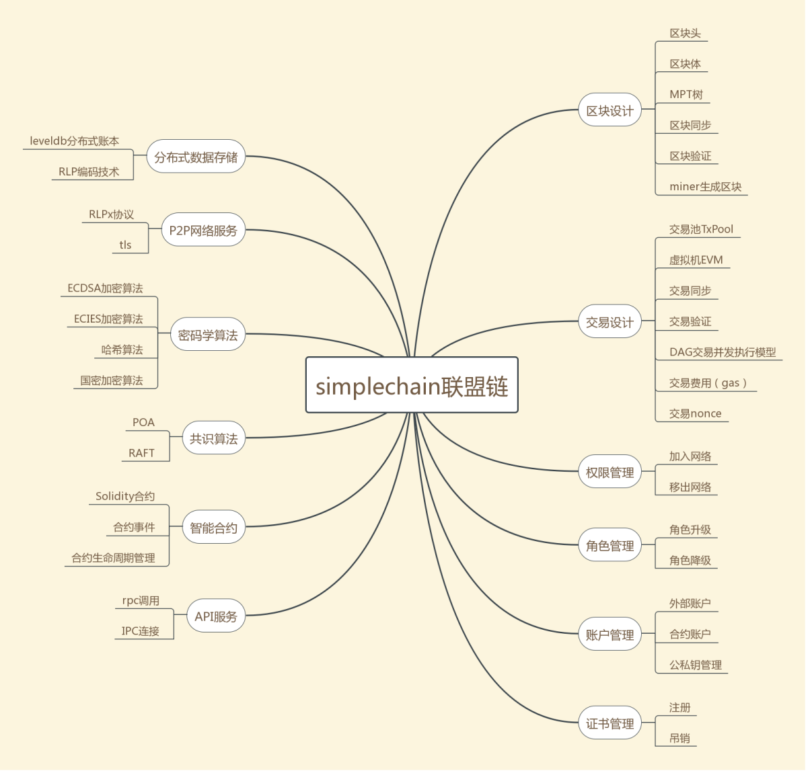

## 第1章概述

### 1.1 Simplechain介绍
simplechain联盟链是安全可控的企业级联盟链底层平台，该底层平台可应用于文化版权、司法服务、政务服务、物联网、金融、智慧社区等领域。

### 1.2 Simplechain联盟链架构
#### 1.2.1 Simplechain联盟链技术架构图

#### 1.2.2 Simplechain联盟链功能图

以上图中的功能的详细描述请见第三节simplechain联盟链功能模块描述。